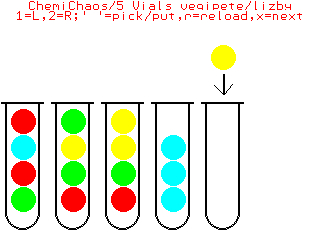

# Chemi Chaos (Redux)

By @lizby derived with permission from the original [ChemiChaos game by @vegipete](https://www.thebackshed.com/forum/ViewTopic.php?TID=13265).

## Instructions

The object is to sort the vials so that all balls of the same color are in the
same vial. There are 10 rounds to play.

**Controls:**

    [Spacebar] - picks the topmost ball from a vial, depending on where the arrow cursor is, or, if a
                 ball has already been picked, places the ball in the vial below the cursor if there
                 is space available and if the topmost ball is of the same color as the "picked" one.  
    [1]        - moves the cursor to the left, if not already at the leftmost vial  
    [2]        - moves the cursor to the right, if not already at the rightmost vial  
    [Z]        - restarts the current round
    [X]        - moves to the next round

**Additional notes:**

The game does not detect when the player has succeeded in sorting all balls. The player must press [x] to move to the next round.
