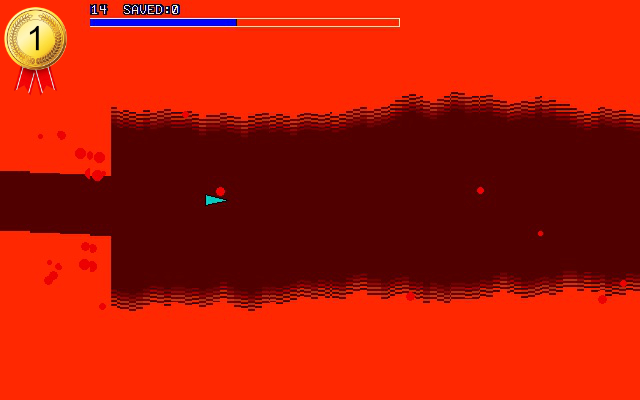

# Hope Robot (1st Place Winner)

By @MauroXavier

You are a testing prototype nanomachine called "HOPE ROBOT", which is the last
hope of humanity to extinguish virus plague that spread to all the world.

Navigate inside human bodies and save patients in this nano adventure for your
Colour Maximite 2.

## Instructions

Press [Space] to fire and cursor keys to move your robot, but be careful,
your nanomachine is moving inside a body and you should not shot in the human
tissues, you must exterminate all viruses and unblock all passages to relieve
the blood circulation.

You start at a middle scenario inside a patient, and as eliminating the blocked
passages and viruses the life will be restored and you hear the heartbeat
stabilising. If you delay doing anything, life decreases with time and if you
shot in human tissues you will hurt the patient, decreasing the life and
disestablishing the heartbeat. The game is over if the life bar reaches the end.

If you fill the life bar then you saved the patient and will restart inside
another human body to save it again, but with each patient saved, the difficulty
will be increased.

You will gain a little score while keeping the patient alive, but the main score
is focused on killing viruses and saving patients.

Good luck, you are our HOPE ROBOT!

**Controls:**

    [Spacebar]    - fire  
    [Cursor keys] - move

## Additional Notes

This game was developed totally focused to keep the rules of this contest but
unfortunately was impossible to keep a minimum of clarity of the code or a
single comment. All algorithm is propositionally out of order and is heavily
unorganized, but was not my intention obfuscate it, but to gain every single
extra character to fulfil my target: give the best experience I can give to the
users at 48x100 characters limitation.
