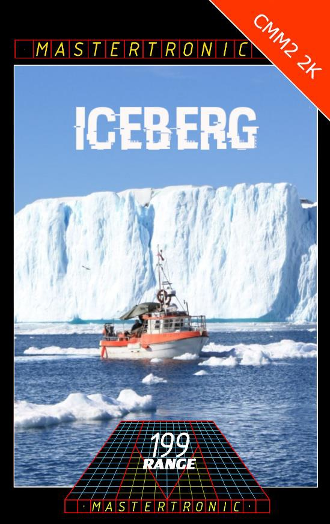
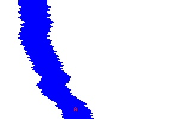

# Iceberg

By @realbobele

In February 2021 a giant tabular iceberg named A-48 calved from Antarctica’s Larsen C ice shelf and started to drift to open waters. You are member of an expedition intended to sample the marine life at the A-48 cleavage line and therefore entered the the gap between the iceberg and the main shelf on an agile but fragile little speedboat. You are far too busy with your research to notice the motion of the iceberg changed with it now drifting back to the shelf, closing the gap at alarming speed. When you realize the danger, you propel your boats engines to highspeed, desperately trying to escape the fate of being crushed between gigatons of floating ice. How far can you get?

## Instructions

Stay clear of the walls of ice and go as far as you can for Highscore

**Controls:**

  [Left cursor] - steer left  
  [Right cursor] - steer right
