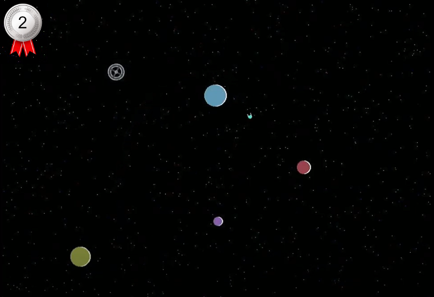

# Gravity Assist (2nd Place Winner)

By @TimD

## Instructions

The spaceship is stranded with only enough fuel for one last short engine burn;
help it get back to the space station by selecting the correct angle using the
left & right cursor keys then pressing [Enter] to ignite the engine, using the
gravity of the surrounding planets to get it home.  Watch out for the black hole
– it’s barely visible but has a very strong gravitational field!

There are 30 levels, and each level has only one solution.  At the beginning of
the game, you can skip to a later level by entering the appropriate 4-letter
code – otherwise, just press [Enter] to start at level 1.

**Controls:**

    [Left cursor]  - increase angle
    [Right cursor] - decrease angle
    [Enter]        - ignite the engine

## Additional Notes

The program creates a hidden sprite sheet using a few basic graphics (including
a flood-filled ‘A’ for the spaceship) and rotations.  Each level is generated
from a single number which serves as a seed for a pseudo-random number generator
(thanks to the User Manual for the algorithm!), and the resulting sequence
determines the number of planets and their positions, the location of the ship
and space station, the initial angle of the ship, the level code and even the
positions of the stars.  An interrupt routine is used to animate the rotation of
the space station and the twinkling of the stars.  There are 3 possible outcomes
for each attempt: (a) the ship safely reaches the space station, (b) it crashes
into a planet (or black hole), or (c) it goes off screen (‘lost in space’).
A crash causes the display to tremble; otherwise, the appropriate 5-note tune is
played.  After the last level is completed, an ending screen is displayed.

Once I’d got the program working, I made a cut-down copy of it that ran through
thousands of possible pseudo-random seed numbers, getting the CMM2 to
automatically play the game for each of the 36 possible angles and only
reporting the seed number if (a) the sprites were sufficiently spaced apart, and
(b) there was exactly 1 solution.  I played these candidate levels to whittle
them down to the 30 most interesting examples and attempted to sort them into a
rough order of increasing difficulty.
