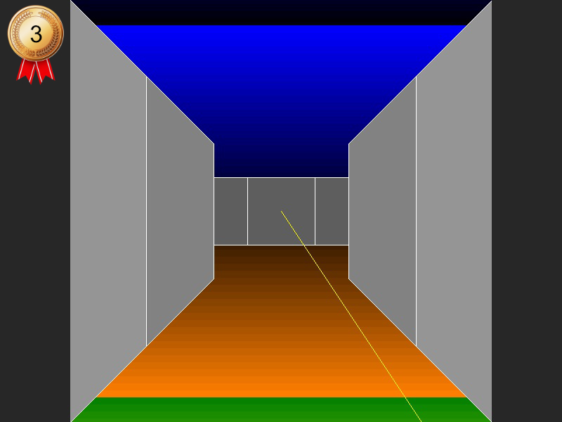
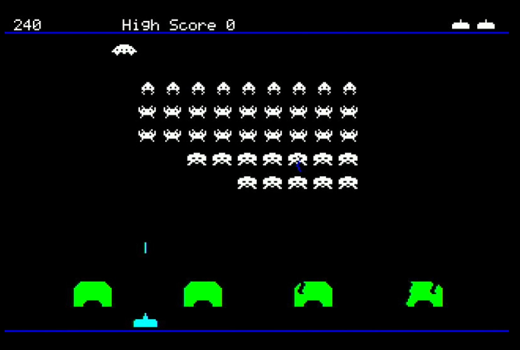
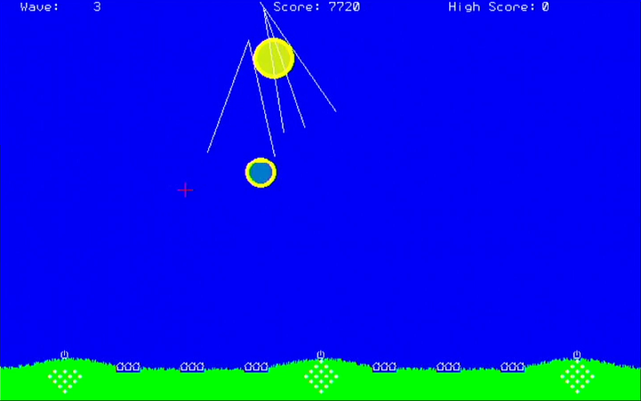

# Escape to the Green Hills (3rd Place Winner)

By @vegipete

@vegipete is a force of nature when it comes to generating programs for the Colour Maximite 2 and the
2021 challenge was no different. He wrote three games (The "Green Hills" saga) and contributed ideas,
optimisations and bugfixes to several of the other entries.

The challenge rules only allowed a single official entry which was "Escape To The Green Hills", but see **Additional Notes** for details of his other contributions.

## Instructions

The alien command pyramid is hovering just above the ground. Your job is to navigate the maze
like pyramid and find and activate the self-destruct device. Others have tried before you but
apparently without success. We hope someone has left a message for you. As far as we know, all
levels except the smallest one near the top, where we can infiltrate you, have an item of interest.
But beware! Some of those items are likely to be aliens, greenish blobs according to reports.
Destroy the pyramid to save the green hills, and hopefully escape out of the lowest level to tell
the tale.

**Controls:**

    [Cursor keys] - forward, backward, turn left and right
    [Spacebar]    - fire (if/when you find a weapon)

If you find an object, move right to it to automatically interact with it. Circular black holes in the floor lead to lower levels.

## Additional Notes

As mentioned above @vegipete wrote three games during the challenge, he also created uncrunched and commented versions of all his code:

 - `extra/GreenHills1.bas`
     - "In Defence of the Green Hills of Earth" (Space Invaders clone)
     - Controls: Cursor keys to move, either [Ctrl] to fire

   

 - `extra/GreenHills1_Expanded.bas`
     - as above but uncrunched and commented
 - `extra/GreenHills2.bas`
     - "In Renewed Defence of the Green Hills" (Missile Command clone)
     - Controls: Requires a 3-button mouse; each button fires from a different missile silo
         - The very first statement of the first line sets the mouse port.
         - Adjust this to match your system.
         - `mp=0` means use the built-in port available with 5.07.00bX

    

- `extra/GreenHills2_Expanded.bas`
     - as above but uncrunched and commented
 - `extra/GreenHills3.bas`
     - "Escape to the Green Hills" - @vegipete's ultimate entry to the challenge
 - `extra/GreenHills3_Expanded.bas`
     - as above but uncrunched and commented
 - `extra/GreenHills3_SplashScreen.bas`
     - crunched version of the above but with a splash screen.
 - `extra/MakeMazer.bas`
     - A utility for creating mazes for episode 3.
     - Level item must be added manually.
     - Use [A] and [Z] to change size, [S] and [X] to place start & exit.
     - Copy the resulting DATA statement into the program.
