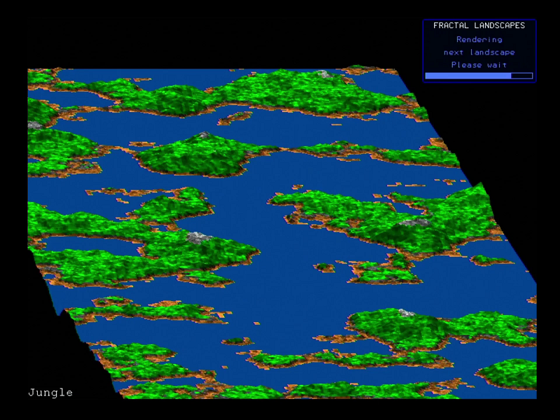
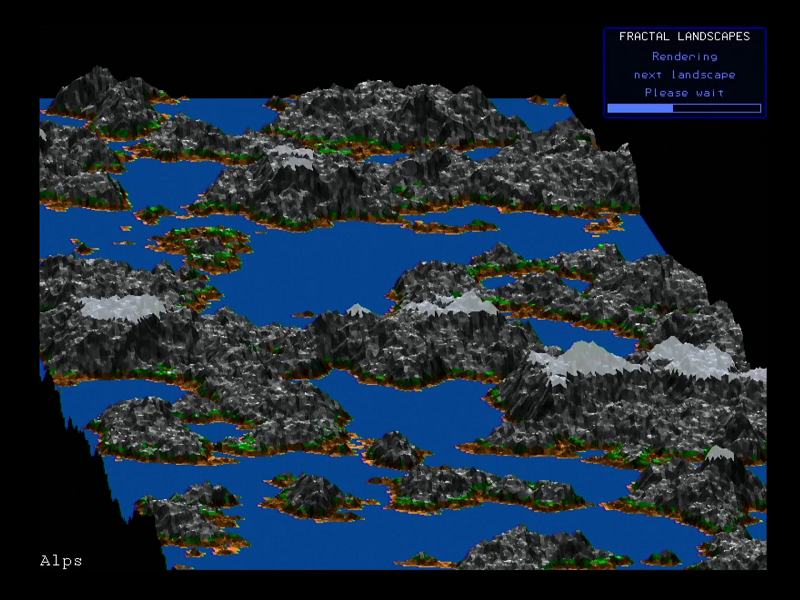

# Fractal Mountains (3rd Place Winner)

By @Lodovik

Here’s my submission for the contest. It’s an adaptation of a program originally published in Compute! Aug 1987, page 89. This program was developed on a CMM2 at 480 MHz.

The original program has been enhanced, reworked and modified to suit a faster machine with better graphics. Even if the core algorithm is basically the same, the rest is quite different.

When you first run the program, you will see the first fractal land generated in real time. Since the process is quite long, the subsequent images are generated while the last completed one is displayed. Be patient! It takes several minutes to generate a landscape and a progress bar will show you the current state of the progress.

The original program generated only one type of landscape in one color (brown), at low resolution. I’ve added more color, bigger landscapes and a totally configurable landscape parameters system (in DATAs). Five presets are already entered and the program will cycle between them. For each preset, the sets of parameters will provide enough randomness to produce greatly varied outputs. More can be added but the file size limit of the contest only allowed me to put 5 sets.

 

Here’s a description of one of the presets:

```
data "Jungle",.25,3, 75,85, 65,70, 10,13, 6,8, 2,3,3,4,1 ,0,64,128
```

‘Jungle' is the displayed title
.25 and 3 describe the range of terrain roughness. .25 is quite flat, 3 will have big mountains. The program chooses a random value between them.
75 and 85: random range (%) for the top of mountains
65 and 70: random range (%) for near the top
10 and 13: random range (%) where the middle portion starts
6 and 8: random range (%) for near the flat surfaces (beaches)
2,3,3,4,1: index for the colors to apply to the different sections above
0,64,128: RGB color of the flat surfaces (water, sand or snow), 31 shades will be generated from the base color

The colors shades are generated here:
```
mkpal 1, 255,158,79 'Brn
mkpal 2, 255,255,255 'Wht
mkpal 3, 0,255,0 'Grn
mkpal 4, 128,128,128 'Gry
mkpal 5, 200,200,255 ’Blu
```

Format is index,R,G,B. 8 colors slots defined, only 5 used.

The `mkpal` sub also generates lighter versions of the colors with a +8 index.

