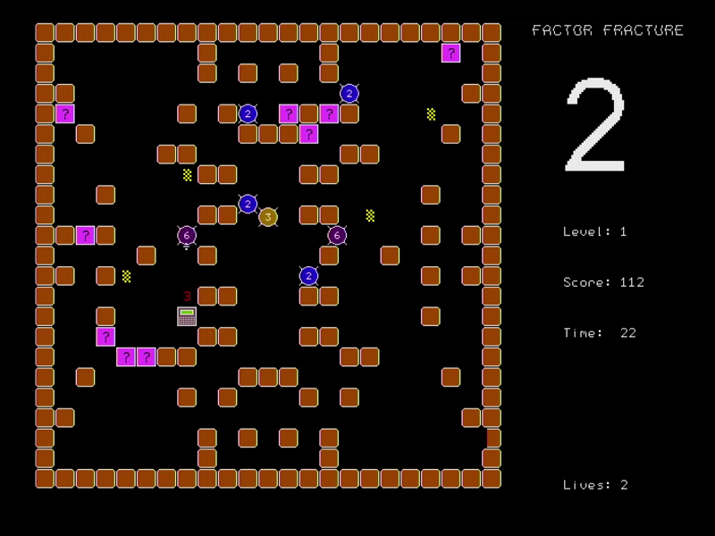

# Factor Fracture (2nd Place Winner)

By @TimD

_A game combining elements of some of my favourite old arcade games with the magic of mathematics 😊._



## Instructions

The numbers have gone rogue!  Enemy numbers will emerge from the four yellow chequered areas, which will flash red shortly beforehand.  Guide your trusty calculator around the level, avoiding the enemies, and shooting the pink boxes to open them.  Inside a box you may find a number (your ‘factor’) or a key; move over the object to pick it up.  The factor is your weapon – when you shoot one of the enemy numbers, if your factor matches the enemy’s number then the enemy is destroyed; otherwise, if the enemy can be divided by the factor then the enemy will divided down accordingly.  So if your factor is 2, you can destroy an enemy 2; but if you hit an enemy 6 then it will transform into an enemy 3 instead.  Collect the 4 keys to gradually open an exit on the right-hand wall through which you can escape – and if you’ve destroyed all the enemies then you’ll get a bonus based on the time remaining.  When the time hits zero, the ghostly (and invincible) enemy zero will emerge and ‘zero’ in on you, so get out quick!  When you start a new life, your calculator is invisible (and can’t be killed by an enemy) for a few seconds.

There are 5 levels, and you get 3 lives.  The large number displayed on the right is your current factor.

### Controls:

```
[Up/Down/Left/Right cursor] - move
[Left Shift] - fire
``` 

## Technical Details

The arena for each level is generated using a pseudo-random number generator, so each level can be defined using a single number.  The layout of the walls is horizontally & vertically symmetrical.  A sprite sheet is drawn on page 2; the game is drawn on page 1 and copied to page 0 for flicker-free animation.  The movement of the sprites is controlled by an interrupt for consistent timing, and a maximum of 7 enemies is allowed at any time.  The arena layout and the objects are stored in a 2-dimensional array of 22x22 squares, each square being 20x20 pixels.  The game uses the text-to-speech generator not only to pronounce words & phrases, but also to generate brief sound effects.  Roll-over is used for the up/down/left/right key presses for smoother control.

## Files

 * [FactorFracture.bas](FactorFracture.bas)
      * the game as entered into the challenge.
 * [FactorFractureBig.bas](FactorFractureBig.bas)
      * an expanded version of the actual entry including indenting, blank lines and more comments.
 * [README.md](README.md)
      * this file.
