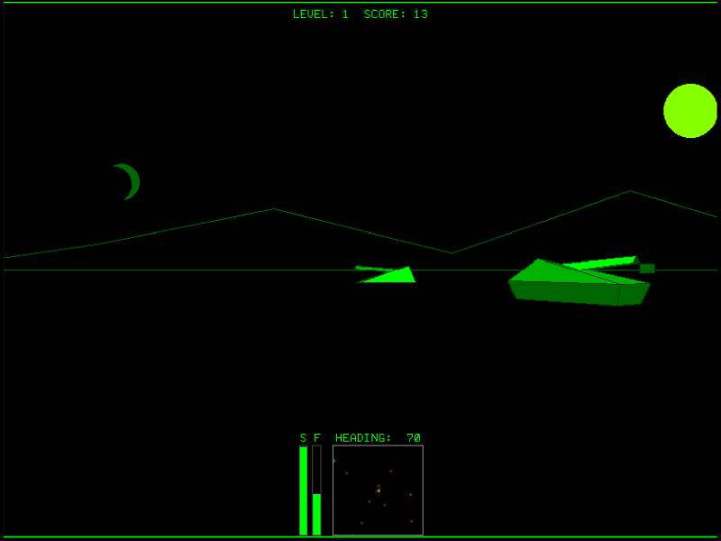

# Stellar Battle in the Seven Green Hills Zone (1st Place Winner)

By @VegiPete

A rendition of Stellar 7 and Battlezone, written in MMBasic for the Colour Maximite 2 computer.

## Instructions

See [StellarBattleinthe7GreenHillsZone.pdf](StellarBattleinthe7GreenHillsZone.pdf)

## Files

 * [SBSGHZv02.bas](SBSGHZv02.bas)
      * 5116 incredible bytes worth of indecipherable gobble-dee-gook.
 * [SBSGHZv02EXP.bas](SBSGHZv02EXP.bas)
      * an expanded version of the actual entry, which, while still partially compressed, is much more human readable.
 * [SBSGHZv02MMB4W.bas](SBSGHZv02MMB4W.bas)
      * a slight modification of the expanded version with some minor changes to work better with MMBasic for Windows.
 * [StellarBattleinthe7GreenHillsZone.pdf](StellarBattleinthe7GreenHillsZone.pdf)
      * a game instruction manual.
 * [README.md](README.md)
      * this file.

## Additional Notes

Linefeed characters must be removed to fall under the Challenge's 5K length limit.
Opening the program with the CMM2 built in editor, then resaving the program will add linefeeds, resulting in an oversized program.
You have been warned.
