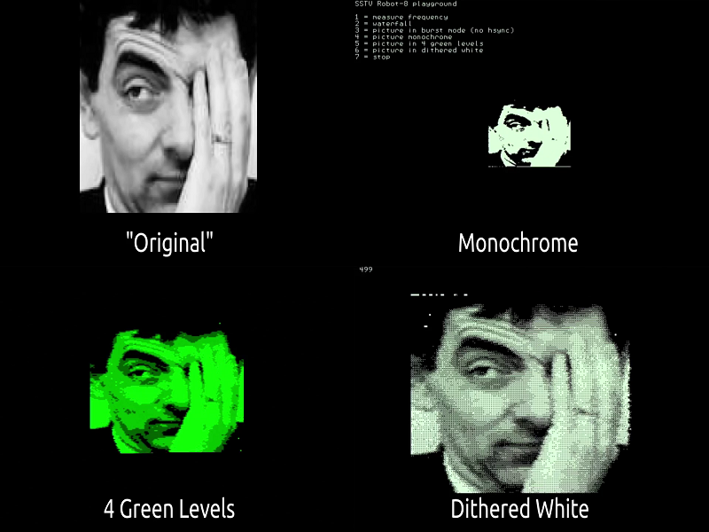

# Robot-8 SSTV Decoder

By @Volhout

A decoder for Robot-8 SSTV (Slow Scan Television) signals.

Developed by amateur radio enthusiasts, [SSTV (Slow-Scan Television)](https://en.wikipedia.org/wiki/Slow-scan_television) is a transmission standard for sending video pictures over an audio channel. The early equipment consisted of analog electronics and picture tubes with storage capability and the earliest eye-catching application was by NASA who used it to send footage of the dark side of the moon. The Robot corporation was a company that influenced SSTV in the early days, since the early 1970’s they delivered encoders and decoders, and have contributed to the standard.

For more details see [SSTV.pdf](SSTV.pdf).
